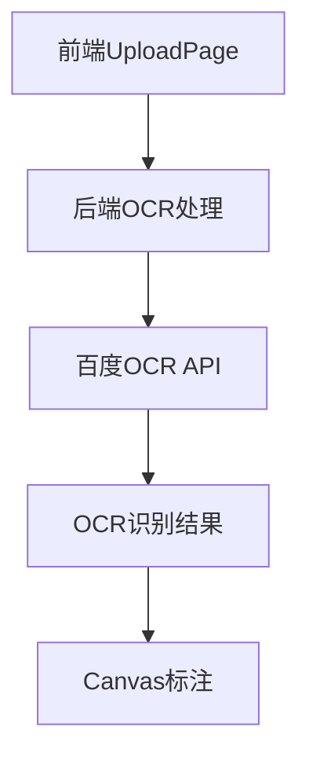
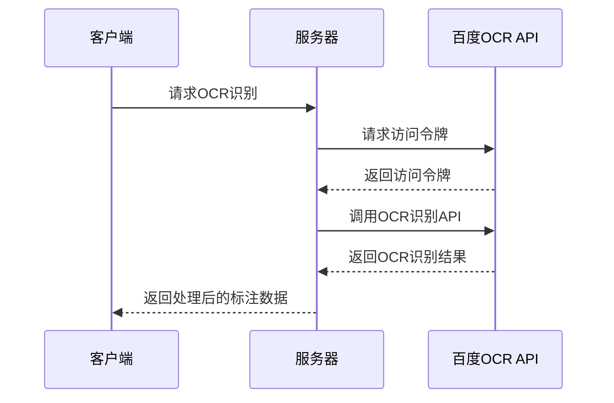

# 百度OCR API集成设计文档

## 1. 概述

本设计文档旨在描述如何将百度OCR API集成到现有的楷书字库项目中，用于识别书法字体并进行标注。用户已创建了百度OCR应用，提供了必要的认证信息，包括AppID、API Key和Secret Key。

## 2. 架构设计

### 2.1 系统架构



### 2.2 组件交互流程

1. 用户在前端选择使用百度OCR进行字符识别
2. 前端上传图像到后端
3. 后端获取百度OCR访问令牌
4. 后端调用百度OCR通用文字识别（高精度含位置版）API
5. 百度OCR返回识别结果，包括字符及其位置信息
6. 后端处理结果并返回给前端
7. 前端使用Canvas在原图上标注识别出的字符

## 3. API端点设计

### 3.1 获取访问令牌端点

- **URL**: `/api/baidu-ocr/token`
- **方法**: GET
- **描述**: 获取百度OCR API访问令牌
- **响应**:
  ```json
  {
    "access_token": "24.adda7617055577f012211c327662827d.2592000.1518752954.282335-1234567",
    "expires_in": 2592000
  }
  ```

### 3.2 OCR识别端点

- **URL**: `/api/baidu-ocr/recognize`
- **方法**: POST
- **描述**: 调用百度OCR识别图像中的字符
- **请求参数**:
  - `image`: 图像文件（base64编码）
- **响应**:
  ```json
  {
    "words_result": [
      {
        "words": "永",
        "location": {
          "top": 100,
          "left": 150,
          "width": 50,
          "height": 50
        }
      }
    ]
  }
  ```

## 4. 数据模型

### 4.1 OCR识别结果模型

| 字段名 | 类型 | 描述 |
|--------|------|------|
| words | string | 识别出的字符 |
| location.top | integer | 字符区域上边界坐标 |
| location.left | integer | 字符区域左边界坐标 |
| location.width | integer | 字符区域宽度 |
| location.height | integer | 字符区域高度 |

### 4.2 标注数据模型

| 字段名 | 类型 | 描述 |
|--------|------|------|
| workId | string | 作品ID |
| characterName | string | 字符名称 |
| positionX | integer | 标注区域左上角X坐标 |
| positionY | integer | 标注区域左上角Y坐标 |
| width | integer | 标注区域宽度 |
| height | integer | 标注区域高度 |

## 5. 业务逻辑层

### 5.1 认证流程



### 5.2 图像处理流程

1. 接收前端上传的图像文件
2. 将图像转换为base64编码格式
3. 获取百度OCR访问令牌
4. 调用百度OCR通用文字识别（高精度含位置版）API
5. 解析返回的识别结果
6. 将结果转换为统一的标注数据格式
7. 返回给前端进行Canvas标注

## 6. 前端实现

### 6.1 OCR来源选择

在UploadPage组件中，用户可以选择OCR识别来源：
- 本地OCR引擎 (Tesseract.js)
- 外部OCR服务 (百度OCR)

### 6.2 Canvas标注实现

前端将使用Canvas组件在原图上标注识别出的字符：
1. 加载原图到Canvas
2. 根据OCR识别结果，在相应位置绘制矩形框
3. 在矩形框内显示识别出的字符

## 7. 后端实现

### 7.1 百度OCR集成模块

创建新的`baidu-ocr.js`模块，包含以下功能：
1. 获取访问令牌
2. 调用OCR识别API
3. 处理和转换识别结果

### 7.2 API端点实现

在`server.js`中添加新的API端点：
1. `/api/baidu-ocr/token` - 获取访问令牌
2. `/api/baidu-ocr/recognize` - OCR识别端点

### 7.3 与现有OCR模块的集成

修改现有的OCR处理逻辑，根据用户选择的OCR来源（本地或百度OCR）调用相应的处理函数。

## 8. 安全考虑

1. 百度OCR的API Key和Secret Key将存储在环境变量中，不在代码中硬编码
2. 访问令牌将被缓存并在有效期内重复使用，减少API调用次数
3. 对用户上传的图像文件进行大小和格式验证
4. 实现适当的错误处理和日志记录机制

## 9. 测试计划

### 9.1 单元测试

1. 测试百度OCR访问令牌获取功能
2. 测试OCR识别API调用功能
3. 测试识别结果转换为标注数据的功能
4. 测试错误处理逻辑

### 9.2 集成测试

1. 测试从前端上传图像到获取OCR标注结果的完整流程
2. 测试Canvas标注功能的正确性
3. 测试不同OCR来源选项的切换功能

## 10. 部署考虑

1. 将百度OCR的认证信息配置到环境变量中
2. 确保服务器能够访问百度OCR API
3. 监控API调用次数和配额使用情况